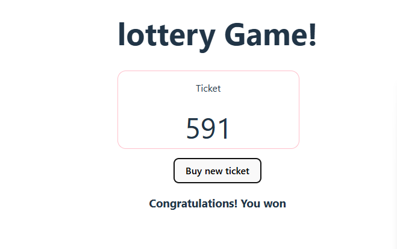

# 🎲 Lottery Game - React Mini Project

This is a simple lottery game built using React components. The game generates a random 3-digit lottery ticket when the user clicks a button. If the sum of the digits in the ticket equals 15, the user wins the lottery.

---

## 🚀 Features

- 🎟️ Generate a random 3-digit lottery ticket (e.g., 123, 007, 560)
- ➕ Automatically calculates the sum of the digits
- 🏆 Displays a winning message if the sum equals 15
- 🎮 Simple, interactive UI built with React

---

## 📸 Demo

---

